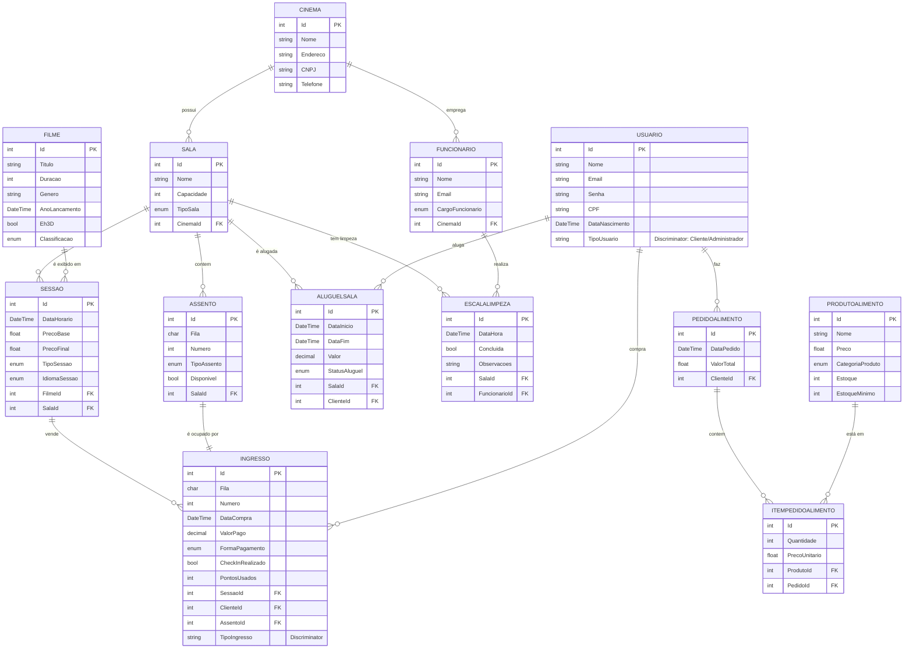

# CineCore - Sistema de Gerenciamento de Cinemas

## 📋 Descrição do Projeto

API RESTful completa para gerenciamento de cinema desenvolvida como projeto final da disciplina de Desenvolvimento Web com .NET. O sistema permite gerenciar cinemas, filmes, salas, sessões, venda de ingressos, alimentos e muito mais.

---

## 🛠️ Tecnologias Utilizadas

- **.NET 10.0**
- **C#**
- **ASP.NET Core Web API**
- **Entity Framework Core 10.0.2**
- **SQL Server**
- **AutoMapper 12.0.1**
- **Swagger/OpenAPI**

---

## 📊 Modelagem do Banco de Dados

### Diagrama Entidade-Relacionamento



> **Nota**: USUARIO possui hierarquia TPH (Table Per Hierarchy) com subtipos Cliente e Administrador. INGRESSO também usa TPH com IngressoInteira e IngressoMeia.

### Diagrama Alternativo (Texto)

<details>
<summary>Clique para ver diagrama em ASCII</summary>

```
                                     ┌──────────────────┐
                         ┌───────────┤     CINEMA       │
                         │           ├──────────────────┤
                         │ 1         │ Id (PK)          │
                         │           │ Nome             │
                         │           │ Endereco         │
                         │           │ CNPJ             │
                         │           │ Telefone         │
                         │           └────┬─────────────┘
                         │                │
                         │ N              │ 1
                         │                │
                         │                │
                    ┌────┴─────────┐      │         ┌────────────────┐
                    │ FUNCIONARIO  │◄─────┼─────────┤ ESCALALIMPEZA  │
                    ├──────────────┤      │         ├────────────────┤
                    │ Id (PK)      │      │         │ Id             │
                    │ Nome         │      │         │ DataHora       │
                    │ Email        │      │   ┌─────┤ SalaId (FK)    │
                    │ Cargo        │      │ N │     │ FuncionarioId  │
                    │ CinemaId(FK) │ ┌────┴───┴─────┴────────────────┐
                    └──────────────┘ │      SALA                     │
                                     ├───────────────────────────────┤
                                     │ Id (PK)                       │
                   ┌─────────────────┤ Nome                          │
                   │                 │ Capacidade                    │
                   │     ┌───────────┤ Tipo                          │
                   │     │ 1         │ CinemaId (FK)                 │
                   │     │           └───────────────────────────────┘
                   │     │                 ┌──────────────────┐
                   │     │                 │     FILME        │
                   │     │                 ├──────────────────┤
                   │     │                 │ Id (PK)          │
                   │     │                 │ Titulo           │
                   │     │                 │ Duracao          │
                   │     │                 │ Genero           │
                   │     │                 │ AnoLancamento    │
                   │     │                 │ Eh3D             │
                   │     │                 │ Classificacao    │
                   │     │                 └────┬─────────────┘
                   │     │                      │ 1
                   │     │ N                    │ N
                   │   ┌─┴───────────┐   ┌──────┴────────────┐
                   │   │  ASSENTO    │   │     SESSAO        │
                   │   ├─────────────┤   ├───────────────────┤
                   │   │ Id (PK)     │   │ Id (PK)           │
                   │   │ Fila        ├──┐│ DataHorario       │
                   │   │ Numero      │1 ││ PrecoBase         │───┐
                   │   │ Tipo        │  ││ PrecoFinal        │   │
                   │   │ Disponivel  │  ││ Tipo              │   │
                   │   │ SalaId (FK) │  ││ Idioma            │   │ N
                   │   └─────────────┘  ││ FilmeId (FK)      │   │
                   │              1:1   ││ SalaId (FK)       │   │
                   │                    │└───────────────────┘   │
                   │               ┌────┘         ▲              │
                   │ N             │              │ 1            │
                   │          ┌────┴─────────┐    │              │
                   │          │   INGRESSO   │    │              │
                   │          ├──────────────┤    │              │
                   │          │ Id (PK)      │    │              │
                   │          │ * Fila       │    │              │
                   │          │ * Numero     │    │              │
                   │  ┌───────┤ DataCompra   │    │              │
                   │  │       │ ValorPago    │    │              │
                   │  │       │ CheckIn...   ┼────┘              │
                   │  │       │ SessaoId(FK) │                   │
                   │  │       │ ClienteId(FK)│                   │
                   │  │       │ AssentoId(FK)│                   │
                   │  │       │ TipoIngresso │◄──┐               │
                   │  │       └──────────────┘   │               │
                   │  │           ▲    ▲         │               │
                   │  │           │    │         │ Discriminator │
                   │  │           │    └─────────┤ TPH           │
                   │  │  ┌────────┘              │               │
                   │  │  │                       │               │
       ┌───────────┴──┴──┴─────┐   ┌────────────┴───────┐       │
       │  IngressoInteira      │   │  IngressoMeia      │       │
       ├───────────────────────┤   ├────────────────────┤       │
       │ (herda de Ingresso)   │   │ Motivo             │       │
       └───────────────────────┘   └────────────────────┘       │
                                                                 │
   ┌──────────────────┐                                          │
   │    USUARIO       │                                          │
   ├──────────────────┤                                          │
   │ Id (PK)          │                                          │
   │ Nome             │                                          │
   │ Email            │                                          │
   │ Senha            │      ┌───────────────────────────────────┘
   │ CPF              │      │
   │ DataNascimento   │      │
   │ TipoUsuario      │ ◄────┘ Discriminator (TPH)
   └────┬─────────────┘
        │
        ├──► CLIENTE ──────────────────────────────┬────────────┐
        │    ├─ Telefone                           │            │
        │    ├─ PontosAcumulados         ┌─────────┴─────────┐  │ 1
        │    ├─ NivelFidelidade           │  ALUGUELSALA     │  │
        │    │                            ├──────────────────┤  │
        └──► ADMINISTRADOR                │ Id               │  │
                                          │ DataInicio       │  │
                                          │ ValorTotal       │  │
                                          │ SalaId (FK) ─────┼──┼───► SALA
                                          │ ClienteId (FK)   │◄─┘
                                          └──────────────────┘
                                                    │ N
  ┌──────────────────┐              ┌───────────────┴──┐
  │ PRODUTOALIMENTO  │              │ PEDIDOALIMENTO   │
  ├──────────────────┤              ├──────────────────┤
  │ Id (PK)          │◄─────────┐   │ Id (PK)          │
  │ Nome             │          │   │ DataPedido       │
  │ Preco            │          │ N │ ValorTotal       │
  │ Categoria        │          │   │ ClienteId (FK)   │
  │ Estoque          │          │   └──────────────────┘
  │ EstoqueMinimo    │          │            │
  └──────────────────┘          │            │ 1
                                │            │
                          ┌─────┴────────┐   │ N
                          │ ITEMPEDIDO   │   │
                          ├──────────────┤   │
                          │ Id (PK)      │◄──┘
                          │ Quantidade   │
                          │ PrecoUnit.   │
                          │ ProdutoId(FK)│
                          └──────────────┘
```

</details>

### Principais Relacionamentos

- **Cinema** `1:N` **Sala** - Um cinema possui várias salas
- **Cinema** `1:N` **Funcionario** - Um cinema possui vários funcionários  
- **Sala** `1:N` **Assento** - Uma sala possui vários assentos
- **Sala** `1:N` **Sessao** - Uma sala pode ter várias sessões
- **Sala** `1:N` **AluguelSala** - Uma sala pode ter vários aluguéis
- **Sala** `1:N` **EscalaLimpeza** - Uma sala possui várias escalas de limpeza
- **Filme** `1:N` **Sessao** - Um filme pode ter várias sessões
- **Sessao** `1:N` **Ingresso** - Uma sessão pode ter vários ingressos vendidos
- **Assento** `1:1` **Ingresso** - Um assento pode ter no máximo um ingresso
- **Cliente** `1:N` **Ingresso** - Um cliente pode comprar vários ingressos
- **Cliente** `1:N` **PedidoAlimento** - Um cliente pode fazer vários pedidos
- **Cliente** `1:N` **AluguelSala** - Um cliente pode alugar várias salas
- **Cliente** `N:N` **Ingresso** (Cortesias) - Sistema de cortesias
- **PedidoAlimento** `1:N` **ItemPedidoAlimento** - Um pedido possui vários itens
- **ProdutoAlimento** `1:N` **ItemPedidoAlimento** - Um produto pode estar em vários itens
- **Funcionario** `1:N` **EscalaLimpeza** - Um funcionário pode ter várias escalas

### Hierarquias (TPH - Table Per Hierarchy)

**Usuario** (tabela única com discriminator):
- `Cliente` - adiciona: Telefone, PontosAcumulados, NivelFidelidade
- `Administrador` - usuário com privilégios administrativos

**Ingresso** (tabela única com discriminator):
- `IngressoInteira` - ingresso de preço integral
- `IngressoMeia` - adiciona campo Motivo (estudante, idoso, etc.)

---

## 🎯 Funcionalidades Implementadas

### Requisitos Obrigatórios

#### ✅ Gestão de Filmes, Salas e Sessões
- CRUD completo de filmes
- CRUD completo de salas
- CRUD completo de sessões
- **Validação de conflito de horários**: Não permite criar sessão se já houver filme rodando na sala

#### ✅ Venda de Ingressos
- Venda de ingresso inteiro
- Venda de meia-entrada
- **Verificação de lotação**: Valida se a sessão não está lotada antes de vender
- Verificação de classificação indicativa

#### ✅ Desafios LINQ/SQL

**1. Cartaz - Filmes nos próximos 7 dias**
```csharp
GET /api/Relatorio/cartaz?inicio={data}&fim={data}&disponiveis={bool}
```
Lista filmes com sessões disponíveis no período especificado (padrão: 7 dias).

**2. Ocupação por Sala**
```csharp
GET /api/Relatorio/salas/ocupacao?inicio={data}&fim={data}
```
Lista salas e sua taxa de ocupação (ingressos vendidos / capacidade total).

### Funcionalidades Extras (Criatividade)

#### 🎭 Sistema Avançado de Cinema
- **Tipos de Sala**: Normal, XD, VIP, 4D
- **Tipos de Sessão**: Regular, Matinê, Pré-estreia, Evento, Especial (Bebê/Pet)
- **Tipos de Assento**: Normal, Casal, PCD, Preferencial
- **Idioma**: Dublado, Legendado, Nacional

#### 👤 Sistema de Usuários
- Autenticação de administradores e clientes
- Perfis com dados completos
- Sistema de fidelidade com pontos
- Descontos de aniversário

#### 🎫 Sistema de Ingressos Avançado
- Reserva antecipada (com taxa)
- Check-in eletrônico
- Sistema de pontos (usar e ganhar)
- Cupons de desconto de parceiros
- Cálculo automático de troco detalhado

#### 🍿 Sistema de Alimentos
- Catálogo de produtos (Pipoca, Bebida, Combo, Doce)
- Controle de estoque
- Pedidos vinculados a clientes
- Alertas de estoque baixo

#### 🏢 Gestão Operacional
- Aluguel de salas para eventos
- Escala de limpeza de salas
- Gestão de funcionários (Gerente, Garçom, Faxineiro, Bilheteiro)
- Validações de requisitos (ex: Sala VIP exige garçom)

#### 📊 Relatórios Completos
- Total de ingressos vendidos
- Receita total (ingressos + alimentos)
- Ingressos por filme
- Sessões com maior ocupação
- Produtos mais vendidos
- Vendas por período
- Taxa média de ocupação

---

## 🏗️ Arquitetura do Projeto

### Estrutura de Pastas

```
cinecore/
├── controladores/        # Controllers da API (camada de apresentação)
├── servicos/            # Lógica de negócio
├── modelos/             # Entidades do banco de dados
├── dados/               # DbContext e configurações do EF Core
├── DTOs/                # Data Transfer Objects (entrada/saída da API)
├── Mappings/            # Perfis do AutoMapper
├── enums/               # Enumerações do domínio
├── excecoes/            # Exceções customizadas
├── utilitarios/         # Classes auxiliares
└── Migrations/          # Migrações do Entity Framework
```

### Padrões e Boas Práticas

- ✅ **Injeção de Dependência**: Todos os serviços registrados como Scoped
- ✅ **Separation of Concerns**: Controllers, Services, Repositories
- ✅ **DTOs**: Separação entre modelos de domínio e API
- ✅ **AutoMapper**: Mapeamento automático entre DTOs e entidades
- ✅ **Exceções Customizadas**: Tratamento de erros padronizado
- ✅ **Status Codes HTTP**: Uso correto (200, 201, 400, 404, 409, 500)
- ✅ **Validações**: Data Annotations e validações de negócio
- ✅ **Migrations Automáticas**: Aplicadas automaticamente ao iniciar

---

## 🚀 Como Executar

### Pré-requisitos

- .NET 10.0 SDK
- SQL Server (LocalDB ou instância completa)
- Visual Studio 2022 ou VS Code

### Passos

1. **Clone o repositório**
   ```bash
   git clone <seu-repositorio>
   cd projetofinal/cinecore
   ```

2. **Configure a string de conexão**
   
   Edite `appsettings.json` ou `appsettings.Development.json`:
   ```json
   {
     "ConnectionStrings": {
       "CineFlow": "Server=(localdb)\\mssqllocaldb;Database=CineFlowDb;Trusted_Connection=true;TrustServerCertificate=true"
     }
   }
   ```

3. **Execute as migrations** (se necessário)
   ```bash
   dotnet ef database update
   ```
   
   > **Nota**: As migrations são aplicadas automaticamente ao iniciar a aplicação.

4. **Execute o projeto**
   ```bash
   dotnet run
   ```

5. **Acesse o Swagger**
   ```
   https://localhost:7xxx/swagger
   ```

---

## 📡 Principais Endpoints da API

### Filmes
- `POST /api/Filme/Criar` - Criar filme
- `GET /api/Filme` - Listar filmes
- `GET /api/Filme/Obter/{id}` - Obter filme por ID
- `PUT /api/Filme/Atualizar/{id}` - Atualizar filme
- `DELETE /api/Filme/Deletar/{id}` - Deletar filme

### Sessões
- `POST /api/Sessao/Criar` - Criar sessão (com validação de conflito)
- `GET /api/Sessao` - Listar sessões
- `GET /api/Sessao/Obter/{id}` - Obter sessão por ID
- `PUT /api/Sessao/Atualizar/{id}` - Atualizar sessão
- `DELETE /api/Sessao/Deletar/{id}` - Deletar sessão

### Ingressos
- `POST /api/Ingresso/VenderInteira` - Vender ingresso inteiro
- `POST /api/Ingresso/VenderMeia` - Vender meia-entrada
- `POST /api/Ingresso/CheckIn/{id}` - Realizar check-in
- `DELETE /api/Ingresso/Cancelar/{id}` - Cancelar ingresso

### Relatórios (Desafios)
- `GET /api/Relatorio/cartaz` - **Cartaz (filmes próximos 7 dias)**
- `GET /api/Relatorio/salas/ocupacao` - **Taxa de ocupação por sala**
- `GET /api/Relatorio/ingressos/total` - Total de ingressos vendidos
- `GET /api/Relatorio/ingressos/receita` - Receita de ingressos
- `GET /api/Relatorio/sessoes/maior-ocupacao` - Sessões mais lotadas

### Outros
- Salas, Cinemas, Usuários, Funcionários, Produtos, Pedidos, Aluguel de Salas, Limpeza

---

## 🧪 Exemplos de Uso

### Criar uma Sessão

```http
POST /api/Sessao/Criar
Content-Type: application/json

{
  "dataHorario": "2026-02-15T20:00:00",
  "precoBase": 25.00,
  "tipo": "Regular",
  "idioma": "Dublado",
  "filmeId": 1,
  "salaId": 1
}
```

### Vender Ingresso

```http
POST /api/Ingresso/VenderInteira
Content-Type: application/json

{
  "sessaoId": 1,
  "clienteId": 1,
  "fila": "A",
  "numero": 10,
  "formaPagamento": "Credito",
  "valorPago": 30.00,
  "reservaAntecipada": false,
  "pontosUsados": 0
}
```

### Obter Cartaz (Desafio 1)

```http
GET /api/Relatorio/cartaz?inicio=2026-02-10&fim=2026-02-17&disponiveis=true
```

### Obter Ocupação por Sala (Desafio 2)

```http
GET /api/Relatorio/salas/ocupacao?inicio=2026-02-01&fim=2026-02-28
```

---

## 📚 Enumerações Principais

- **ClassificacaoIndicativa**: Livre, Dez, Doze, Quatorze, Dezesseis, Dezoito
- **TipoSala**: Normal, XD, VIP, QuatroD
- **TipoSessao**: Regular, Matine, PreEstreia, Evento, EspecialBebe, EspecialPet
- **IdiomaSessao**: Dublado, Legendado, Nacional
- **FormaPagamento**: Dinheiro, Debito, Credito, PIX
- **CargoFuncionario**: Gerente, Garcom, Faxineiro, Bilheteiro
- **CategoriaProduto**: Pipoca, Bebida, Combo, Doce

---

## 👨‍💻 Autores

Vinicius Leon Paula 
Jordan Verissimo Guimarães dos Santos
Projeto Final de Desenvolvimento Web com .NET

---

## 📄 Licença

Este projeto foi desenvolvido como trabalho acadêmico para a disciplina de Desenvolvimento Web com .NET.

---
